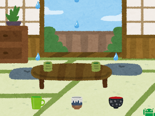

#  Amamorion
Amamorion is a toy sound sequencer inspired by leak in the roof.

https://hiroyuki-komatsu.github.io/amamorion/

* You can click the cup, bowl and pot to change the sound.
* You can stop the motion by cliking the Droid.
* The tempos are randomly generated, reload to try different tempos.
